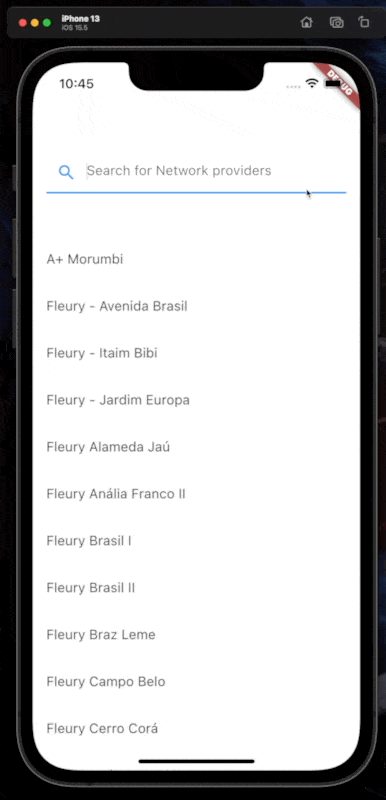

# Network providers 🔄

<!-- show case/gif section -->

<p align="center">
  
  <br/>
</p>

<!-- show case/gif section END -->

<!-- about app and course section -->

---

## About this App 🗣

In this app, it is possible see the list of providers in the network (doctors, laboratories, hospitals), in addition to being able to search by providers.
<br/>

> 💡 The Search feature match the search term with the beginning of the name of each provider (case sensitive).

This project has a simple CI pipeline, to analyze the code and run the unit and widget tests.
<br/>
For more information, check the [ci.yaml][ci] file, which has the whole process in detail, step by step.

---

## Running the project locally 🔨

1. Clone this repository into your machine:

```bash
git clone https://github.com/samuelematias/network_providers.git
```

2. With the repository cloned, open the repository root in your terminal and run the command:

```bash
bash ./scripts/flutter_packages.sh
```

With FVM (In project root, and into each package, run this command):

```bash
fvm flutter pub get
```

---

## Tech Stack 👩🏾‍💻

> 💪 Building with sound null safety 💪

- [Dart - 2.17.6][dart]
- [Flutter - 3.0.5][flutter]

> Aren't you in this Flutter/Dart vesion? Consider taking a look at [FVM][fvm], I believe it can help you at this point 😉.

---

## Packages/Plugins 📟

- [bloc][bloc]
- [bloc_test][bloc_test]
- [build_runner][build_runner]
- [equatable][equatable]
- [flutter_bloc][flutter_bloc]
- [json_annotation][json_annotation]
- [json_serializable][json_serializable]
- [mocktail][mocktail]
- [very_good_analysis][very_good_analysis]

---

<!-- ALL-CONTRIBUTORS-LIST:START - Do not remove or modify this section -->

## Contributors 🚀

<!-- prettier-ignore -->
<table>
  <tr>
    <td align="center"><a href="https://twitter.com/samuelematias"><br /><sub><b>Samuel Matias</b></sub></a><br /><a href="https://www.linkedin.com/in/samuelematias/"title="Code">💻</a><a href="https://linktr.ee/samuelematias"title="Design"> 🎨</a></td></td>
</table>

<!-- ALL-CONTRIBUTORS-LIST:END -->

<!-- about app and course section END -->

<!-- Stuffs links -->

[ci]: https://github.com/samuelematias/network_providers/blob/main/.github/workflows/ci.yml
[dart]: https://dart.dev/
[flutter]: https://flutter.dev/
[fvm]: https://fvm.app/

<!-- Packages/Plugins -->

[bloc]: https://pub.dev/packages/bloc
[bloc_test]: https://pub.dev/packages/bloc_test
[build_runner]: https://pub.dev/packages/build_runner
[equatable]: https://pub.dev/packages/equatable
[flutter_bloc]: https://pub.dev/packages/flutter_bloc
[json_annotation]: https://pub.dev/packages/json_annotation
[json_serializable]: https://pub.dev/packages/json_serializable
[mocktail]: https://pub.dev/packages/mocktail
[very_good_analysis]: https://pub.dev/packages/very_good_analysis
